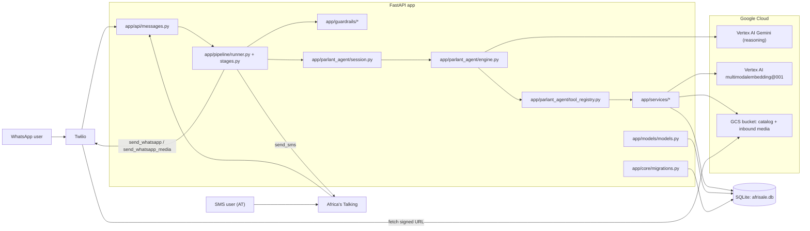
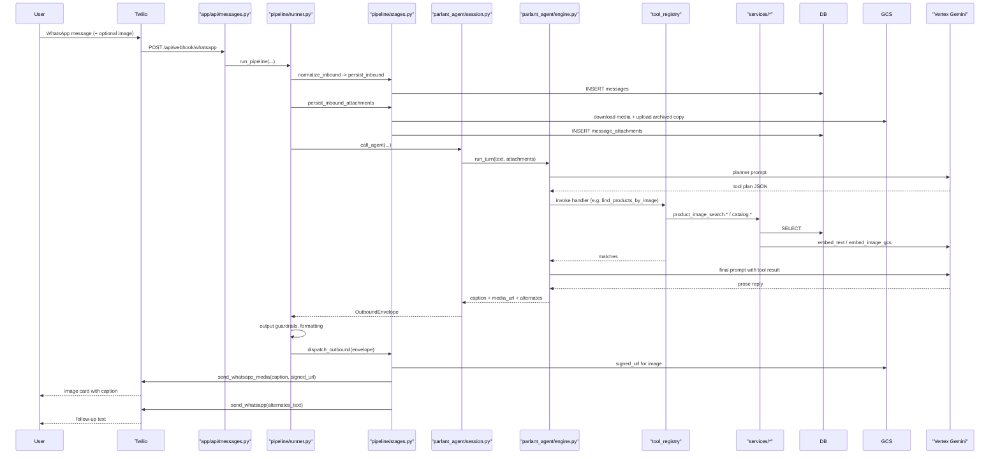
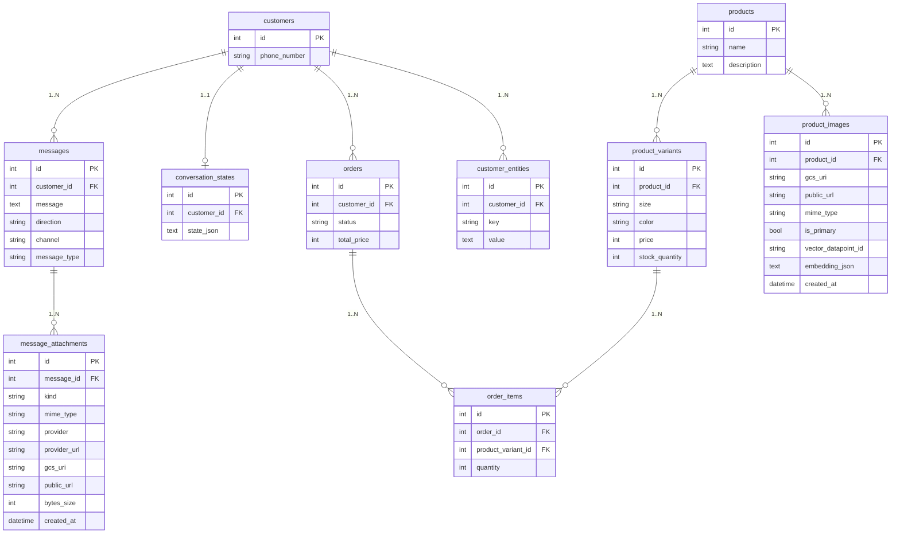
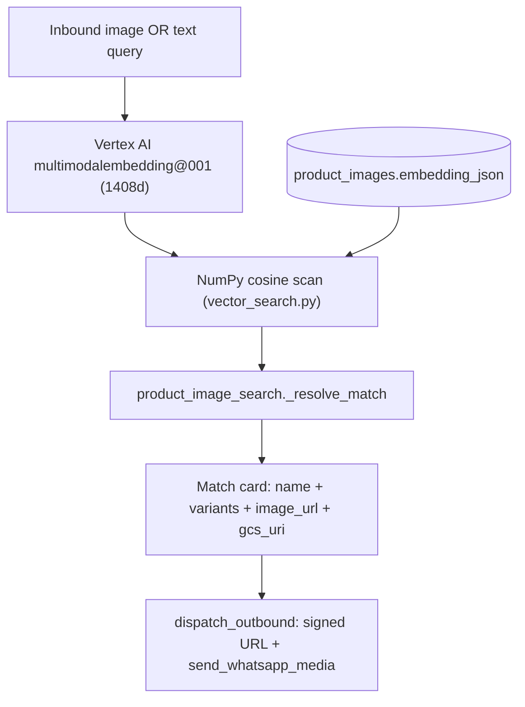
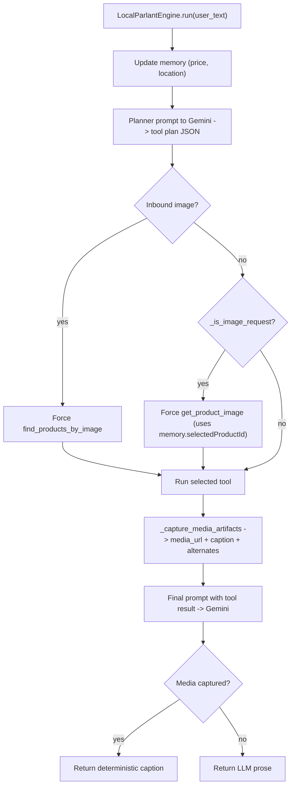
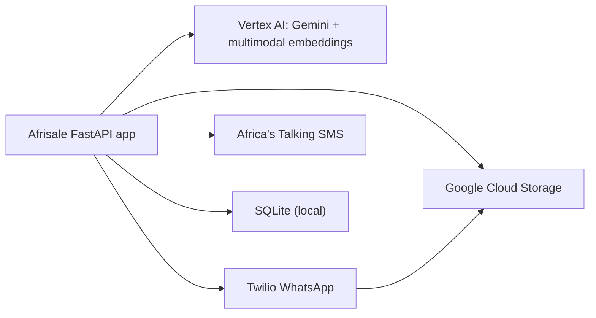

# Afrisale MVP — Project Structure & Architecture

A snapshot of the codebase as of this writing. Use this as the canonical map for onboarding, planning, and refactor discussions. Sections below mirror the directory layout and call out which files are canonical vs. drafts.

---

## 1. What this project is

Afrisale is a WhatsApp/SMS storefront agent. A buyer chats in natural language ("do you have black t-shirts", or sends a photo of a polo shirt), and the system replies with grounded catalog answers — including image cards rendered as WhatsApp media messages. There is also an "owner" role that can update stock, prices, and add catalog images.

The agent runtime is a Parlant-style orchestrator (with a local fallback) that calls Vertex AI Gemini for reasoning and Vertex AI multimodal embeddings for image/text similarity. Catalog images are stored in Google Cloud Storage; embeddings are stored *locally* on each `product_images` row and searched with NumPy cosine similarity (we deliberately stepped down from Vertex AI Vector Search after an org-policy block — see `IMPLEMENTATION_PHASE.md` if it exists, or the recent chat summary).

---

## 2. High-level architecture



---

## 3. Inbound-to-outbound message lifecycle



---

## 4. Directory layout (annotated)

```
Afrisale(mvp)/
├─ main.py                        FastAPI entrypoint; create_all + ensure_schema; mounts /api router
├─ requirements.txt               Pinned dependencies (FastAPI, SQLAlchemy, Twilio, google-cloud-*, numpy)
├─ .env / .env.example            Runtime config (GCP, Twilio, AT, thresholds)
├─ afrisale.db                    Local SQLite (gitignored in real deploys)
│
├─ app/                           ── Application package ──
│  ├─ api/messages.py             FastAPI routes:
│  │                                /api/health
│  │                                /api/webhook         (JSON, e.g. AT-style)
│  │                                /api/webhook/whatsapp(Twilio form-encoded)
│  │
│  ├─ core/                       Cross-cutting infra
│  │  ├─ config.py                pydantic-settings — every env var lives here
│  │  ├─ database.py              SQLAlchemy engine + SessionLocal + get_db dependency
│  │  └─ migrations.py            ensure_schema() — idempotent ALTER TABLE for additive columns
│  │
│  ├─ models/models.py            SQLAlchemy ORM models (single-file schema). See data model below.
│  │
│  ├─ pipeline/                   Inbound-to-outbound orchestrator
│  │  ├─ runner.py                run_pipeline(...) — top-level function the webhook calls
│  │  └─ stages.py                normalize / persist_inbound / call_agent / dispatch_outbound
│  │                              + OutboundEnvelope dataclass
│  │                              + signed-URL helper for Twilio media fetch
│  │
│  ├─ guardrails/                 Validation + formatting layers
│  │  ├─ input_guardrail.py       Inbound text validation; allows empty text when attachment present
│  │  ├─ output_validation.py     Sanity-checks the agent reply (length, prohibited content)
│  │  ├─ output_formatting.py     Channel-specific formatting; truncates to 1024 for WhatsApp captions
│  │  ├─ input_guardrails.py      Legacy/draft (see "Legacy files" below)
│  │  └─ output_guardrails.py     Legacy/draft
│  │
│  ├─ parlant_agent/              Agent runtime
│  │  ├─ engine.py                LocalParlantEngine: planner -> tool -> final prompt
│  │  │                            - _is_image_request heuristic
│  │  │                            - _build_caption (deterministic name/price/variants)
│  │  │                            - _capture_media_artifacts (media_url, gcs_uri, alternates)
│  │  ├─ session.py               AfrisaleSession: per-customer engine setup
│  │  │                            - assembles tools + guidelines + memory
│  │  │                            - run_turn / run_turn_with_media
│  │  ├─ tool_registry.py         build_customer_tools / build_owner_tools
│  │  │                            - get_catalog, search_products
│  │  │                            - find_products_by_text, find_products_by_image
│  │  │                            - get_product_image  (NEW: serves "share an image" turns)
│  │  │                            - create_order, get_order_status
│  │  │                            - owner: add_product, update_stock, update_price,
│  │  │                              list_all_orders, add_product_image
│  │  ├─ guidelines.py            Static role guidelines for customer / owner
│  │  └─ providers/
│  │      ├─ base.py              ProviderError abstraction
│  │      └─ gemini_provider.py   google.genai client wired to Vertex (project + location)
│  │
│  ├─ services/                   Domain-level (DB-bound) services
│  │  ├─ catalog.py               FTS5 + RapidFuzz keyword search; get/add/update catalog
│  │  ├─ catalog_image_ingest.py  GCS upload + Vertex embedding -> ProductImage row
│  │  ├─ embeddings.py            Wraps Vertex multimodalembedding@001 (text/image/gcs)
│  │  ├─ vector_search.py         Local NumPy cosine over product_images.embedding_json
│  │  ├─ product_image_search.py  search_by_image / search_by_text / get_product_card
│  │  ├─ media_service.py         Inbound media: parse Twilio fields, download, GCS, persist
│  │  ├─ message_service.py       Customer/Message persistence helpers
│  │  ├─ orders.py                Order creation + status lookup
│  │  └─ conversation_state_service.py  ConversationState JSON memory CRUD
│  │
│  ├─ integrations/               Outbound-only adapters (no DB writes here)
│  │  ├─ twilio_whatsapp.py       send_whatsapp / send_whatsapp_media
│  │  ├─ twilio_media.py          Authenticated download of Twilio MediaUrl{N}
│  │  ├─ africastalking.py        Outbound SMS (with skip_sms_send dev mode)
│  │  └─ gcs.py                   upload_bytes / public_https_url / signed_url / delete_object
│  │
│  ├─ observability/logger.py     Async-firable structured log helpers used across pipeline
│  ├─ schemas/schemas.py          Pydantic DTOs (e.g. WebhookPayload)
│  ├─ memory/                     (placeholder — currently empty package)
│  └─ agents/                     (placeholder — currently empty package)
│
├─ scripts/                       Operational scripts
│  ├─ seed_test_products.py       Seeds the 12 baseline products + variants
│  ├─ seed_product_images.py      Bulk-ingest catalog images via folder OR JSON map
│  ├─ list_catalog.py             Inspect products + variants + image coverage
│  ├─ read_local_db_catalog.py    Raw catalog dump
│  ├─ database_read_write_test.py DB smoke
│  ├─ agentTest.py / agent_test.py Interactive single-turn agent runners
│  ├─ send_whatsapp_helper.py     Manual outbound test
│  ├─ test_webhhok.py             Webhook smoke (typo preserved)
│  ├─ _w.py … _w10.py             Numbered draft scratch files (NOT canonical)
│  └─ README.md                   Script usage notes
│
├─ images_afri/                   Local catalog source images (9 photos)
├─ images.json                    Map: catalog photos -> product IDs (for the seeder)
│
├─ pytests/                       Phase-based test scripts
│  ├─ testphase1.py … testphase5.py
│  └─ test_hybrid_memory.py
│
├─ gcp_test.py                    GCP ADC + Vertex Gemini smoke
├─ gcs_test.py                    GCS upload smoke
├─ test_search.py                 Local search smoke
├─ agent_testV2.py                Newer agent test driver
│
├─ ARCHITECTURE_USER_FLOW_AND_MEDIA_PLAN.md   Earlier architecture write-up (predates the local-cosine pivot)
├─ PARLANT_WHATSAPP_INTEGRATION_GUIDE.md      Guide for porting the agent pattern to other projects
├─ IMAGE_SEARCH_SMOKE_TESTS.md                Manual smoke checklist for image search
├─ TWILIO_WEBHOOK_CHECKLIST.md                Twilio sandbox setup notes
├─ IMPLEMENTATION_PHASE.md                    Phased delivery notes
├─ README.md                                  Repo overview
├─ commands.md / randomideas.md / project_state.md / thought_process_agentic_eval.md / bug_analysis.md / problem1documentation.py / problem1documentations/*
│                                              Misc dev notes (not part of the runtime)
└─ index_config.json                          Old Vertex Vector Search index config (no longer used)
```

---

## 5. Data model



`conversation_states.state_json` carries the agent's structured per-customer memory (`selectedProductId`, `lastProductCandidates`, `lastInboundAttachments`, `lastImageSearchMatches`, `deliveryLocation`, etc.). Definition lives in [app/services/conversation_state_service.py](app/services/conversation_state_service.py).

---

## 6. Layer responsibilities

| Layer | Files | Purpose | Knows about |
| --- | --- | --- | --- |
| Transport | `api/messages.py`, `integrations/twilio_*`, `integrations/africastalking.py` | HTTP webhooks in; provider SDK calls out | Twilio, AT |
| Pipeline | `pipeline/runner.py`, `pipeline/stages.py` | Orchestrates a turn end-to-end; owns `OutboundEnvelope` | Guards, Session, GCS (for signing) |
| Guardrails | `guardrails/input_guardrail.py`, `output_validation.py`, `output_formatting.py` | Defensive validation + WhatsApp-specific formatting | Channel + media flag only |
| Agent | `parlant_agent/session.py`, `engine.py`, `tool_registry.py`, `guidelines.py`, `providers/*` | Plan -> tool call -> grounded reply; deterministic caption | Tools, memory, Gemini |
| Services | `services/*` | Domain ops: catalog, orders, embeddings, vector search, media, memory | DB, GCS, Vertex |
| Models | `models/models.py` | SQLAlchemy schema — single source of truth | DB only |
| Migrations | `core/migrations.py` | Lightweight idempotent ALTER for additive changes | DB only |

The cardinal rule: **only services touch the DB**. Tools wrap services for the agent. Pipeline + dispatch wrap services for transport. The agent never opens a session itself; the session is injected.

---

## 7. Image search architecture (current MVP)



Two cross-modal thresholds applied in [app/services/product_image_search.py](app/services/product_image_search.py):

- `IMAGE_MATCH_MIN_SIMILARITY_IMAGE = 0.30` — when the user uploads a photo (intra-modal cosine).
- `IMAGE_MATCH_MIN_SIMILARITY_TEXT  = 0.06` — when the user types a description (cross-modal cosine; multimodal embeddings cluster text and images separately, so legitimate matches score lower).

---

## 8. Configuration

All runtime config lives in [app/core/config.py](app/core/config.py) backed by `.env`. Categories:

- **Database** — `DATABASE_URL` (SQLite default).
- **GCP / Vertex** — `GCP_PROJECT_ID`, `GCP_LOCATION`, `GCP_MODEL`, `GOOGLE_APPLICATION_CREDENTIALS`, `VERTEX_VECTOR_DIMENSIONS`, `VERTEX_EMBEDDING_MODEL`.
- **GCS** — `GCS_BUCKET_PRODUCTS`, `GCS_SIGNED_URL_TTL_SECONDS`.
- **Twilio** — `TWILIO_ACCOUNT_SID`, `TWILIO_AUTH_TOKEN`, `TWILIO_WHATSAPP_FROM`.
- **Africa's Talking** — `AT_USERNAME`, `AT_API_KEY`, `AT_SENDER_ID`, `SKIP_SMS_SEND`.
- **LLM** — `LLM_TIMEOUT_SECONDS`, `LLM_RETRY_ATTEMPTS`, `LLM_RETRY_BACKOFF_SECONDS`.
- **Image limits** — `IMAGE_MAX_BYTES`, `IMAGE_ALLOWED_MIMES`, `IMAGE_MATCH_TOP_K`, the two `IMAGE_MATCH_MIN_SIMILARITY*` thresholds.
- **Owner identity** — `OWNER_PHONE` (E.164; controls customer-vs-owner role split).
- **Deprecated** — `VERTEX_VECTOR_INDEX_ID`, `VERTEX_VECTOR_INDEX_ENDPOINT_ID`, `VERTEX_VECTOR_DEPLOYED_INDEX_ID`. Kept loadable for backward compat; not read by the local cosine path.

---

## 9. How a turn is decided (engine internals)



Two hard overrides bypass planner drift:

1. **Inbound image** -> `find_products_by_image` (visual similarity).
2. **"Share an image" / "send a photo" intent** -> `get_product_image` (text follow-up resolves to memory.selectedProductId).

When media artifacts are captured, the engine **replaces** the LLM prose with `_build_caption(top_match)` — guarantees stable card layout regardless of LLM phrasing.

---

## 10. Legacy / draft files (heads-up before refactor)

These exist in tree but are not the canonical implementations. Safe to delete after a confirm-pass with the team:

- `app/guardrails/input_guardrails.py` (canonical: `input_guardrail.py`).
- `app/guardrails/output_guardrails.py` (canonical: `output_validation.py` + `output_formatting.py`).
- `scripts/_w.py` … `scripts/_w10.py` — numbered scratch files.
- `scripts/test_webhhok.py` — typoed name; consider renaming.
- `index_config.json` — left over from Vertex Vector Search; obsolete now.
- Top-level dev notes: `commands.md`, `randomideas.md`, `project_state.md`, `bug_analysis.md`, `thought_process_agentic_eval.md`, `problem1documentation.py`, `problem1documentations/*`.
- `app/memory/` and `app/agents/` are empty placeholder packages.

The two canonical guardrail files (`input_guardrail.py`, `output_validation.py`, `output_formatting.py`) are the ones the pipeline imports — see [app/pipeline/runner.py](app/pipeline/runner.py).

---

## 11. Run cheatsheet

```bash
# 0. Environment
python -m venv .venv && .venv\Scripts\activate          # Windows
pip install -r requirements.txt
copy .env.example .env                                  # then fill in values

# 1. Smoke (no app server)
python gcp_test.py            # Vertex Gemini reachability
python gcs_test.py            # GCS bucket write
python scripts/list_catalog.py
python scripts/list_catalog.py --missing

# 2. Seed catalog (idempotent if you re-run with fresh map entries)
python scripts/seed_test_products.py
python scripts/seed_product_images.py --map images.json

# 3. Local web
uvicorn main:app --reload --port 8000
# /api/health        sanity
# /api/webhook       JSON inbound (AT-style)
# /api/webhook/whatsapp  Twilio inbound (form-encoded)
```

---

## 12. Key external services and the trust boundary



- The app authenticates to all GCP services via a single service-account JSON key (`GOOGLE_APPLICATION_CREDENTIALS`).
- **Twilio fetches GCS objects anonymously**, so outbound media URLs are signed at dispatch time (`gcs.signed_url`) instead of relying on bucket-level public read. The bucket can stay private.
- The DB is the source of truth for products, orders, messages, attachments, and per-customer memory. The agent never invents data outside what the tools return.

---

_Last updated: see git log for the most recent commits to this file._
